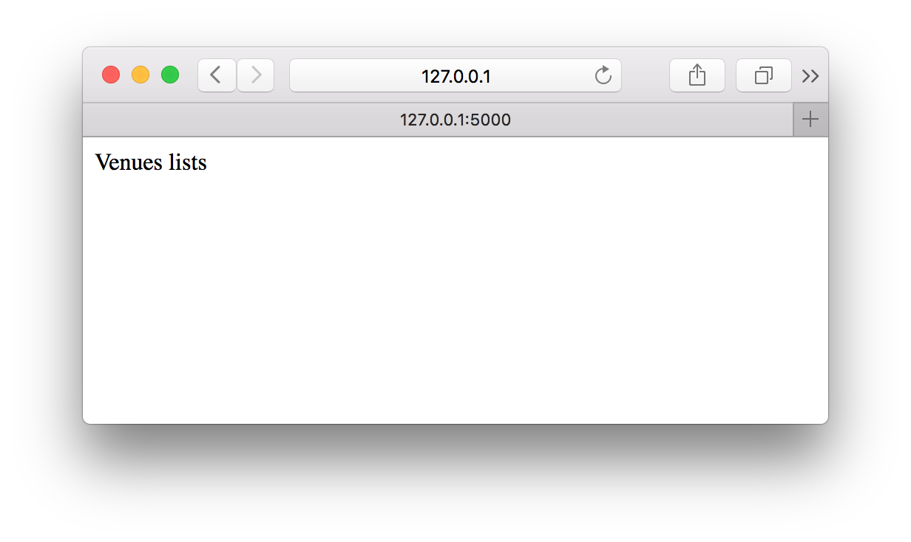
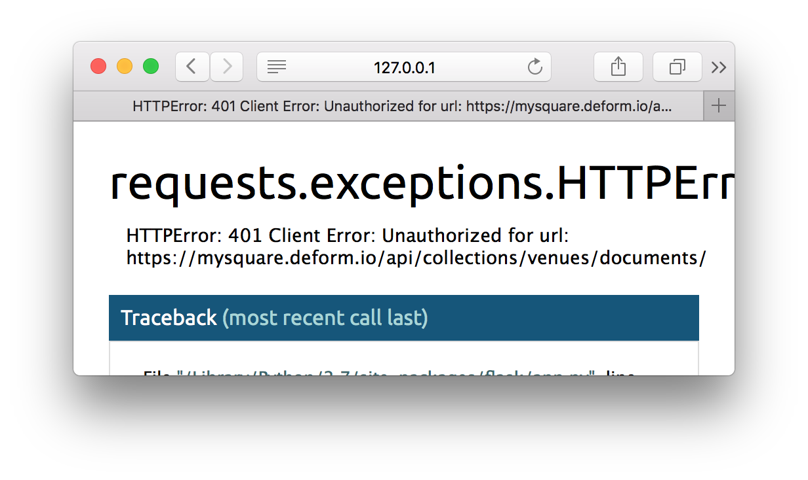
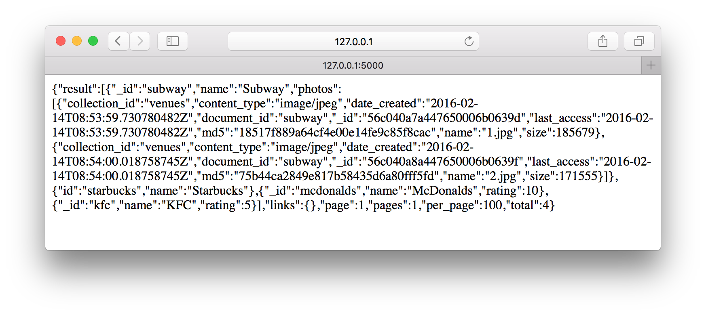

## Setup

This quickstart assumes you have a working installation of [Deform cli](/cli/).
To verify cli is installed, use the following command:

```bash
$ deform
```

If you get `deform: command not found` you must install the CLI by
[following instructions](/cli/#installation).

```bash
$ pip install python-deform
```

## Registration

If you are new to Deform you must create an account:

```bash
$ deform signup -e email@example.com -p mypassword
```

On the email you will get a confirmation code. Use it for confirming you identity:

```bash
$ deform confirm CODE
```

When you confirm the email you automatically become logged in.

```bash
$ deform whoami

You are email@example.com
```

Let's create a new project:

```bash
$ deform project create -d '{"_id": "mysquare", "name": "My square"}'

Project created
```

!!! note
    Be careful with the `_id`.
    It should be unique across the all the Deform projects (even if it doesn't belong to your account!).
    If you have some conflict errors just set the project's id as `mysquare1`, `mysquare2`, etc...

Let's look at the `mysquare` project info:

    $ deform project get mysquare

If you created the project with the id `mysquare3000` then use it:

```bash
$ deform use-project mysquare3000

Switched to project mysquare3000
```

We will use `mysquare` project id through all the documentation. Just don't forget
to use your own id.

## Collections

Deform follows the [MongoDB](https://docs.mongodb.org/manual/reference/glossary/) paradigm
and operates over `collections` and `documents`. To see what collections are already in
project you can type command:

    $ deform collections find --pretty

```json
{  
    "_id": "_files",
    "name": "Files",
    "schema": ...,
    "indexes": ...,
...
},
...
```

Every project in Deform contains system collections which names starts with `_` prefix.
You can't remove them. [Read more about system collections](/collections/#system-collections).

## Documents

Let's create a document in a collection called `venues`:

```bash
$ deform document create -c venues -d '{"name": "Starbucks"}'

{"_id": "5754065208888f00052b7315","name": "Starbucks"}
```

We don't have to create the collection before inserting documents. If there is no collection
`venues` in the project it will be created automatically.

If you don't provide `_id` for the document it will be generated. `_id` is the only
system field. It should be unique and can't be changed. We can remove the document
and recreate it with a custom id:

```bash
$ deform document remove 5754065208888f00052b7315 -c venues

Document removed

$ deform document create -c venues \
    -d '{"_id": "starbucks", "name": "Starbucks"}'

{"_id": "starbucks","name": "Starbucks"}
```

[Read more about documents](/documents).


## Schema

Deform doesn't force you to use a schema for the documents in any collection. This
is the power of the nosql databases.
You can create a venue without the `name` property but with a `rating` property:

```bash
$ deform document create -c venues \
    -d '{"_id": "mcdonalds", "rating": 5}'

{"_id": "mcdonalds","rating": 5}
```

But what if you want the `name` property to be mandatory? That's where you can change
the schema of the `venues` collection.
Deform uses [JSON schema](http://json-schema.org/) and by default it allows you to insert
any properties. Let's look at the `venues` collection schema:

```bash
$ deform collection get venues --property schema --pretty

{  
    "type": "object",
    "properties": {},
    "additionalProperties": true
}
```

Providing `additionalProperties` is `true` you are not limited to use any properties.

Let's make the `name` property required:

```bash
$ deform collection save venues --property schema.properties.name \
    -d '{"type": "string", "required": true}'

Property updated
```

Let's look at the schema again:

```bash
$ deform collection get venues --property schema --pretty

{  
  "type": "object",
  "properties": {
    "name": {
      "type": "string",
      "required": true
    }
  },
  "additionalProperties": true,
}
```

Let's try to create a venue without the `name` property:

```bash
$ deform document create -c venues -d '{"_id": "kfc", "rating": 5}'

Validation error:
* "name" - name is required
```

Oops. Validation error. That's what we've expected. Let's provide the `name`:

```bash
$ deform document create -c venues \
    -d '{"_id": "kfc", "name": "KFC", "rating": 5}'

{"_id": "kfc","name": "KFC","rating": 5}
```

The document've been successfully created. You may be curious what've happened with
the `mcdonalds` venue? Actually nothing, it's still in the `venues` collection:

```bash
$ deform documents find -c venues --pretty

{
    "_id": "starbucks",
    "name": "Starbucks"
}
{
    "_id": "mcdonalds",
    "rating": 10
}
{
    "_id": "kfc",
    "name": "KFC",
    "rating": 5
}
```

Deform doesn't force you to migrate existing documents when the collection's schema is changed.
But when you try to update a document you will be asked to provide the required property:

```bash
$ deform document update mcdonalds -c venues -d '{"rating": 6}'

Validation error:
* "name" - name is required
```

Let's set the name for McDonalds:

```bash
$ deform document update mcdonalds -c venues -d '{"name": "McDonalds"}'

{"_id": "mcdonalds","name": "McDonalds","rating": 5}
```

[Read more about schemas](/schemas).


## Files

Our `venues` collection contains venues with the names but that is not enough.
Let's add some photos!

Deform operates with files like with any data.
Let's add an array property which will contain all the venue photos:

```bash
$ deform collection save venues --property schema.properties.photos \
    -d '{"type": "array", "items": {"type": "file"}}'

Property saved
```

Let's look at the schema:

```bash
$ deform collection get venues --property schema --pretty

{  
  "type": "object",
  "properties": {
    "name": {
      "type": "string",
      "required": true
    },
    "photos": {
      "type": "array",
      "items": {
        "type": "file"
      }
    }
  },
  "additionalProperties": true,
}
```

Providing directory `/tmp/` on your local machine contains two photos:

**1.jpg**


**2.jpg**


Let's create a new venue:

```bash
$ deform document create -c venues \
    -d '{
            "_id":"subway",
            "name":"Subway",
            "photos": [
                @"/tmp/1.jpg",
                @"/tmp/2.jpg"
            ]
        }'
```

The output is:

```json
{
  "_id": "subway",
  "name": "Subway",
  "photos": [
    {
      "_id": "57540c5b94d5de000528f78a",
      "collection_id": "venues",
      "content_type": "image/jpeg",
      "date_created": "2016-06-05T11:26:19.810844798Z",
      "document_id": "subway",
      "last_access": "2016-06-05T11:26:19.810844798Z",
      "md5": "18517f889a64cf4e00e14fe9c85f8cac",
      "name": "1.jpg",
      "size": 185679
    },
    {
      "_id": "57540c5c94d5de000528f78c",
      "collection_id": "venues",
      "content_type": "image/jpeg",
      "date_created": "2016-06-05T11:26:20.262771094Z",
      "document_id": "subway",
      "last_access": "2016-06-05T11:26:20.262771094Z",
      "md5": "75b44ca2849e817b58435d6a80fff5fd",
      "name": "2.jpg",
      "size": 171555
    }
  ]
}
```

Every item in `photos` attribute contains information about saved files.
Let's get a content of the first image:

```bash
$ deform document get-file subway -c venues \
    --property photos[0] > download.jpg
```

If you open downloaded image you will see the original `1.jpg`:

**download.jpg**


[Read more about files](/files).


# Website

Let's build a small website with two pages:

* List page of the all venues
* Detail page of the one venue

We will use python with [Flask](http://flask.pocoo.org/) and [requests](http://docs.python-requests.org/en/master/). Install both packages first:

    $ pip install Flask requests

!!! note
    There is a [deform's python client](http://deformio.github.io/python-deform/).
    Use it for your python projects. For this tutorial we'll use [HTTP API](/api/)
    for more general overview.

Let's create a `mysquare.py` file and write some code:

```python
{!docs/quickstart/examples/001/code/mysquare.py!}
```

Run the site:

    $ python mysquare.py
    * Restarting with fsevents reloader
    * Debugger is active!
    * Debugger pin code: 120-616-853

Website should be running on you local machine.

Open address [http://127.0.0.1:5000/](http://127.0.0.1:5000/) in your web browser. You should see the venues list page:



If you open [http://127.0.0.1:5000/hello](http://127.0.0.1:5000/hello) in your web browser you should see
the venue detail page:


## Retrieving the venues

We know how to retrieve the documents from the collections using Deform CLI.
For retrieving the venues for the website we will use Deform's [HTTP API](/http-api-reference/).

For retrieving documents from the projects collection you must make the `GET` HTTP
request for url compound by next pattern:

```text
https://<project-id>.deform.io/api/collections/<collection-id>/documents/
```

Let's try to make the HTTP request inside the `venues_list` function.

```python
{!docs/quickstart/examples/002/code/mysquare.py!}
```

Let's try to open [http://127.0.0.1:5000](http://127.0.0.1:5000) again. You should see something like this:



We got `401 UNAUTHORIZED` response code. Why did it happen?

Deform does not allow to work with the project data without authorization.
When you've been using CLI you were authorized with login and password.
How to authorize our website application? Let's create a token.

## Creating a token

If you want to authorize any client making changes or retrieving data from any
project you must create the [authorization token](/tokens). Let's create the token
and allow the clients using this token to read the documents from the `venues` collection:

```bash
$ deform document create -c _tokens -d '{
    "_id":"TFWaTgjB",
    "name": "Read venues",
    "is_active": true,
    "permission": {
      "allow": {
        "read": [
          {
            "what": "document",
            "where": "venues"
          }
        ]
      }
    }
  }'
```

```json
{
  "_id": "TFWaTgjB",
  "is_active": true,
  "name": "Read venues",
  "permission": {
    "allow": {
      "read": [
        {
          "what": "document",
          "where": "venues"
        }
      ]
    }
  }
}
```

Let's use the token for retrieving document with [HTTP API](/api/). You must provide
`Authorization` header with value compound by template `Token <token-id>`:

```python
{!docs/quickstart/examples/003/code/mysquare.py!}
```



Cool, we've retrieved all the documents from the `venues` collection.

The final step would be to retrieve a venue document for the venue detail view.
We should add some logic to `venue_detail` function:

```python
{!docs/quickstart/examples/004/code/mysquare.py!}
```

If you visit [http://127.0.0.1/kf](http://127.0.0.1/kf) you will get `404` error because there is no
venue with `_id` equals `kf`:


But there is the venue with `_id` equals `kfc` on page [http://127.0.0.1/kfc](http://127.0.0.1/kfc):


## Creating templates

We've finished with retrieving data from Deform and now let's add templates
for rendering HTML pages.

```python
{!docs/quickstart/examples/005/code/mysquare.py!}
```

`response.json()` function converts json from response to the python's native object.
This object will be used inside the templates. Let's add the template for the venues list:

**templates/venues_list.html**

```html
{!docs/quickstart/examples/005/code/templates/venues_list.html!}
```

If you open index page of the website you will see a list of the links for the
every venue detail page:


Let's add the venue detail template:

**templates/venue_detail.html**

```html
{!docs/quickstart/examples/005/code/templates/venue_detail.html!}
```

Open the [http://127.0.0.1:5000/subway](http://127.0.0.1:5000/subway) page:


As you remember it's possible to get file's content with CLI. For retrieving
file's content with HTTP API you can build a full url by next pattern:

```
https://<project-id>.deform.io/api/collections/<collection-id>/documents/<document-id>/<path-to-file-property>/content/
```

Why don't we see the images on the venue page? Let's look at the developer console:


You should remember that Deform does not allow to work with the project data without authorization.
Browser is yet another client that should authorize it's requests to the HTTP API.
It's possible to send authorization token with `token` query parameter. For example:

```
https://<project-id>.deform.io/.../content/?token=<token>
```

Let's send the token to the template context:

```python
{!docs/quickstart/examples/006/code/mysquare.py!}
```

Use the token in image's content url:

**templates/venue_detail.html**

```html
{!docs/quickstart/examples/006/code/templates/venue_detail.html!}
```

Now all the images are shown.


[Read more about tokens](/tokens/).

# Processing

On the previous step we've shown the venue's photos on the detail page. But the
problem is we've shown full-sized images. It's better to show small photo thumbnail.
Click on the thumbnail will open full-sized image at the new page.

Deform comes with [image resizing processor](/processors/#resize).
Processors should be assigned to collection's schema properties. Every time
document is created or updated processors do their job.

Let's add image resizing processor to `venues` collection schema:

```bash
$ deform collection update venues --property schema.properties.photos \
    -d '{
      "type": "array",
      "items": {
        "type": "object",
        "properties": {
          "original": {
            "type": "file"
          },
          "thumb": {
            "type": "file",
            "processors": [
              {
                "name": "resize",
                "in": {
                  "original_image": {
                    "property": "photos.original"
                  },
                  "size": {
                    "value": [100, 100]
                  }
                }
              }
            ]
          },
        }
      },
    }'

```

## Todo:

* Image resize processors
* Reprocess images (for subway)
* Geolocation
* Search:
    * By name
    * By compound field (with template processors)

show on map
show location near venue (on detail page)
